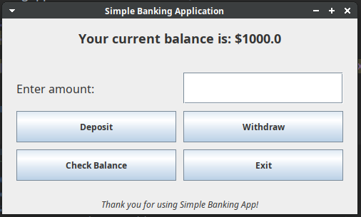
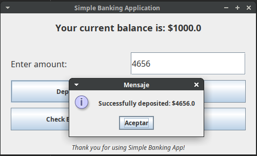
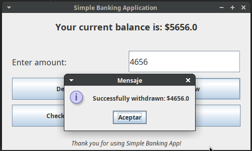

# Simple Banking Application GUI

This is a simple banking application with a graphical user interface (GUI) built using Java's Swing framework. The application allows users to perform basic banking operations like depositing money, withdrawing money, and checking the current balance. It is intended for educational purposes to demonstrate the usage of Swing for building a desktop application in Java.

## Features

- **Deposit Money**: Users can deposit any positive amount into their account.
- **Withdraw Money**: Users can withdraw any amount as long as it's within their current balance.
- **Check Balance**: Users can check their current account balance.
## Screenshots

### Main Window


### Deposit Money


### Withdraw Money


## Prerequisites

- Java Development Kit (JDK) 17 or later
- Any IDE that supports Java (NetBeans, IntelliJ, Eclipse, etc.)

## How to Run

1. Clone this repository:
   ```bash
   git clone https://github.com/yourusername/SimpleBankingAppGUI.git
